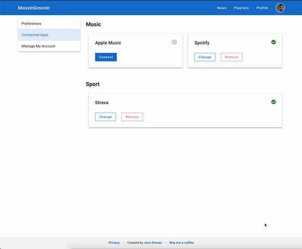

# passport-apple-music

<a href="https://npmjs.com/package/passport-apple-music">
  </img>
  </img>
</a>

PassportJS strategy for generating music user token for Apple Music API.

Use this strategy to obtain tokens for personalized endpoints of Apple Music API, e.g.

`https://api.music.apple.com/v1/me/recent/played`

## Demo



[Read here about how this strategy works](https://dev.to/jurooravec/reverse-engineering-apple-s-musickitjs-to-create-apple-music-strategy-for-passportjs-12h)

## Installation

Install the package via npm / yarn:
``` npm install --save passport-apple-music ```

## Setup

For details on obtaining developer token and integrating Apple Music API with JS, see:

- <https://areknawo.com/apple-music-javascript-integration-guide/>
- <https://developer.apple.com/documentation/applemusicapi/getting_keys_and_creating_tokens>

You will need to obtain and generate:

- teamID
- keyID
- private key corresponding to the keyID (.p8 file) on local filesystem

## Usage

Initialize the strategy as follows:

```ts
import { Strategy as AppleMusicStrategy } from 'passport-apple-music';

passport.use(new AppleMusicStrategy({
  teamID: "<YOUR_TEAM_ID>",
  keyID: "<YOUR_KEY_ID>",
  callbackURL: "<CALLBACK_URL>",
  privateKeyLocation: "path/to/AuthKey_<YOUR_KEY_ID>.p8"
  passReqToCallback: true
}, function(req, accessToken, refreshToken, profile, cb) {
  // The JWT dev token used to generate the music user token can be accessed via req.query.id_token_hint
  // Use this token in authorization header as
  // Authorization: Bearer <DEV_TOKEN>
  const devToken = req.query.id_token_hint;
  // accessToken is the music user token. Always use this token with the devToken above.
  // Music-User-Token: <MUSIC_USER_TOKEN>
  const musicUserToken = accessToken;
  // There is no refreshToken. 

  cb(null, ...);
}));
```

Add the login route:

```js
app.get("/login", passport.authenticate('apple-music'));
```

Finally, add the callback route and handle the response:

```js
app.post("/auth", function(req, res, next) {
  passport.authenticate('apple-music', function(err, user, info) {
    if (err) {
      if (err == "AuthorizationError") {
        res.send("Oops! Looks like you didn't allow the app to proceed. Please sign in again!");
      } else if (err == "TokenError") {
        res.send("Oops! Couldn't get a valid token for Apple Music!");
      }
    } else {
      res.json(user);
    }
  })(req, res, next);
});
```

Example request that uses dev token with music user token:

```ts
const response = await fetch('https://api.music.apple.com/v1/me/recent/played', {
  headers: {
    'Authorization': 'Bearer <DEV_TOKEN>',
    'Music-User-Token': '<MUSIC_USER_TOKEN>',
  },
  ...
});
```

## Options

```ts
{
  /**
   * Your Team ID (aka Developer ID).
   *
   * A 10-letter ID that can be found on your account page at https://developer.apple.com/account/#/membership.
   *
   * This ID requires Apple Developer Program membership ($100/yr).
   */
  teamID: string;
  /**
   * Your Key ID for MusicKit.
   *
   * A 10-letter ID that can be found or created at https://developer.apple.com/account/resources/authkeys/list.
   *
   * The key **MUST** have "MusicKit" among "Enabled Services".
   *
   * To create Key ID with MusicKit access:
   * 1) Create Music IDs Identifier at https://developer.apple.com/account/resources/identifiers
   * 2) Register new Key at https://developer.apple.com/account/resources/authkeys/add
   *    1. Enable (tick) MusicKit
   *    2. Click "Configure" and select the Music ID from step 1)
   *    3. Save / Continue
   * 3) Confirm MusicKit is among enabled services when you go to https://developer.apple.com/account/resources/authkeys/review/<KeyID>
   */
  keyID: string;
  /**
   * Path to the file with private key that belongs to the keyID.
   *
   * Private key can be downloaded from https://developer.apple.com/account/resources/authkeys/review/<KeyID>.
   *
   * Note: Private key can be downloaded only once.
   */
  privateKeyLocation: string;
  /** App Name shown on auth page */
  appName?: string;
  /** Url of app icon shown on auth page */
  appIcon?: string;
  jwtOptions?: SignOptions & {
    /**
     * Encryption algorithm as mentioned in Apple Music API token generation guide.
     *
     * DO NOT override this value unless you know what you are doing.
     *
     * Defaults to 'ES256'.
     *
     * See https://developer.apple.com/documentation/applemusicapi/getting_keys_and_creating_tokens.
     */
    algorithm?: Algorithm;
    /**
     * JWT expiry.
     *
     * Maximum expiry for Apple Music API token is "180d".
     *
     * Expressed in seconds or a string describing a time span [zeit/ms](https://github.com/zeit/ms.js).
     *
     * Eg: 60, "2 days", "10h", "7d"
     */
    expiresIn?: string | number;
  };
  // OAuth2StrategyOptions options:
  callbackURL?: string;
  customHeaders?: OutgoingHttpHeaders;
  scope?: string | string[];
  scopeSeparator?: string;
  sessionKey?: string;
  store?: StateStore;
  state?: any;
  skipUserProfile?: any;
  pkce?: boolean;
  proxy?: any;  
}
```

## FAQ

### Why is there no refresh token?

The authentication flow provides no refresh token. Instead, when the token expires,
the user has to log in once again.

### For how long is the music user token valid?

By default, the token is valid for 180 days. This is the maximum. If you need to change this value,
override the `jwt` options passed to `AppleMusicStrategy`.

### How is the developer token generated?

Token generation is based on <https://leemartin.dev/creating-an-apple-music-api-token-e0e5067e4281>.

### ⚠️ Legal Disclaimer

This repository is NOT developed, endorsed by Apple Inc. or even related at all to Apple Inc. This library was implemented solely by the community's hardwork, and based on information that is public on Apple Developer's website. The library merely acts as a helper tool for anyone trying to integrate with Apple Music API.

## Contributing

Feel free to open issues and pull requests!

---

Repo scaffolded with [typescript-library-starter](https://github.com/alexhayton/generator-typescript-library-starter)
